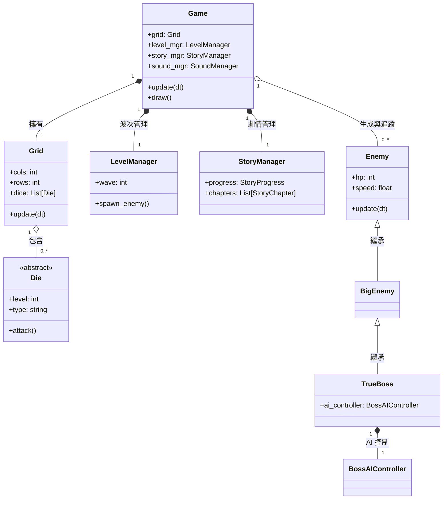
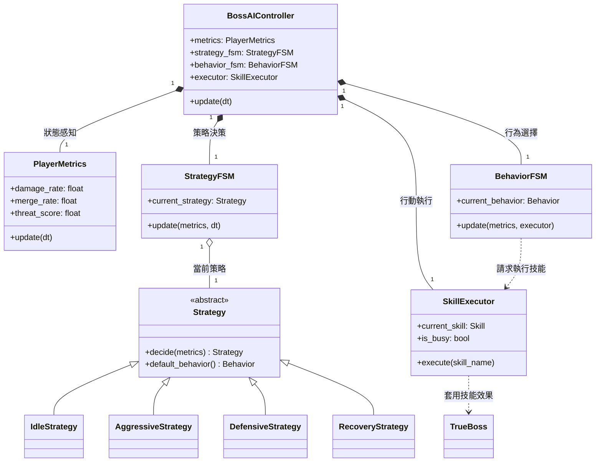
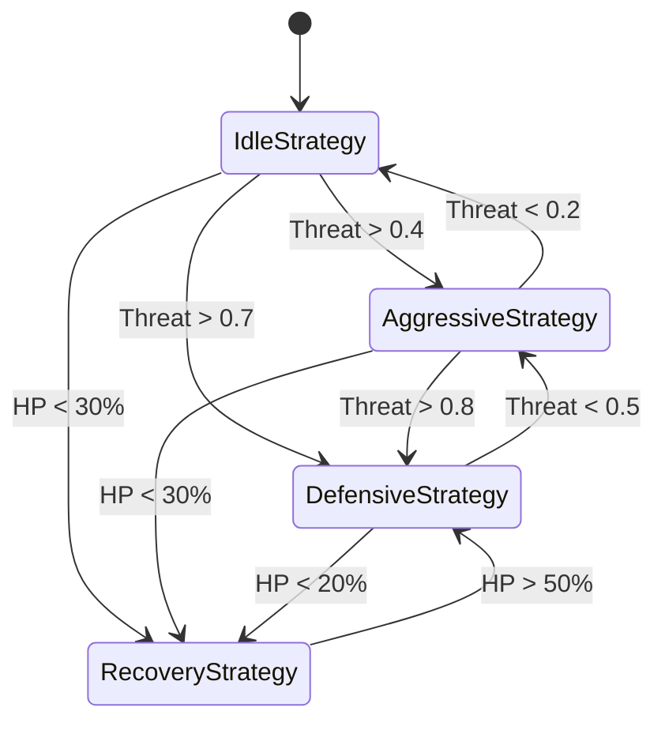

# 🎮 Random Dice Tower Defense (RDproject)

這是一個基於 Python 與 Pygame 開發的塔防遊戲，靈感來自於手遊《隨機骰子 (Random Dice)》。本專案的核心亮點在於實作了一套具備策略感的分層有限狀態機 (HFSM) Boss AI 系統。

## 📖 遊戲描述 (Game Description)

在遊戲中，玩家需要透過召喚與合併骰子來抵禦一波又一波的敵人，保護基地的安全。
- **召喚骰子**：消耗隨召喚次數遞增的金幣，在棋盤空格生成一顆隨機骰子。
- **合併骰子**：將同類型且同等級（點數）的兩顆骰子重疊，即可合併為更高一級的骰子（類型將隨機變換）。
- **骰子類型**：
    - **Single (單體)**：基礎攻擊，射程遠且單發傷害穩定。
    - **Multi (多重)**：具備多目標打擊能力。
    - **Freeze (冰凍)**：顯著減緩敵人的移動速度。
    - **Wind (風色)**：極高的攻擊速度，適合對抗高血量單位。
    - **Poison (中毒)**：附加持續傷害效果。
    - **Iron (鋼鐵)**：針對 Boss 類敵人有顯著的增傷效果。
    - **Fire (火焰)**：對著彈點周圍造成群體濺射傷害。

## ⌨️ 控制方式 (Controls)

- **空格**：召喚新骰子（成本隨次數增加）。
- **左鍵選取**：選中骰子，重疊於符合條件的骰子即可合併。
- **右鍵點擊**：取消當前選擇或退出刪除模式。
- **空白鍵**：快速進行骰子召喚。
- **數字鍵 1-5**：調整遊戲執行速度（1x 到 16x）。
- **N鍵**：若當前無敵人，立即開始下一波。
- **R鍵**：在結束畫面快速重啟遊戲。
- **ESC鍵**：返回大廳或取消當前操作。

## 🚀 遊戲特色 (Features)

- **波次與 Boss 系統**：難度動態成長，每 5 波會出現具備 HFSM AI 智能的強大 Boss。
- **大廳強化系統**：消耗遊戲中獲得的金幣，永久提升骰子的基礎屬性。
- **出戰配置 (Loadout)**：自定義 1~5 種骰子作為你的出戰陣容。
- **分層地圖與章節**：包含不同地形配置的故事模式章節。

## 🛠️ 安裝與執行 (Setup & Run)

1. **運行需求**：確保已安裝 Python 3.x。
2. **安裝依賴**：
    ```bash
    pip install -r requirements.txt
    ```
3. **執行遊戲**：
    切換到 `RDproject` 目錄並執行：
    ```bash
    python main.py
    ```

---

# 🧠 Boss AI 技術架構 — HFSM Project

## 📌 專案概述 (Project Overview)
本專案設計並實作一套適用於 **Random Dice 類型遊戲**的 Boss AI 系統。  
核心目標並非追求數學上的最優策略，而是在高度隨機的遊戲環境中，打造一個**具備策略感、可控性與良好玩家體驗的 Boss 行為模型**。

## 🎯 AI 模型選擇原因
本專案的核心目標為在高度隨機的遊戲環境中，設計一套具備策略感、可控性與良好玩家體驗的 Boss AI 行為系統，而非追求理論上的最優決策模型。基於此目標，強化學習並非最適合的技術選擇。

Random Dice 類型遊戲具備高度非結構化與非平穩（non-stationary）的特性，其棋盤配置、骰子種類、星級分布與玩家策略組合呈現指數級成長，使得狀態空間極為龐大且難以完整建模。於此條件下，強化學習模型不僅難以有效收覽，也難以確保在不同遊戲節奏與策略下維持一致的行為品質。

此外，遊戲中的 Boss 行為設計並非單純的勝負優化問題，而是一項高度依賴遊戲平衡與玩家體感的系統工程。強化學習在 reward function 的設計上難以精確反映「合理壓迫感」、「可預期反制」等質性目標，容易產生雖然數值最優但體驗不佳的行為結果，增加平衡調整與除錯成本。

相較之下，本專案採用的 Hierarchical Finite State Machine（HFSM） 架構能夠以明確的策略分層方式描述 Boss 的行為邏輯，使決策過程具備高度可解釋性與可控性。透過趨勢化的玩家行為指標進行策略切換，HFSM 在不引入訓練成本的前提下，仍能呈現具智能感且穩定的行為表現，更符合本專案在工程實作、遊戲平衡與維護性上的需求。

## � 核心架構詳解

AI 架構嚴格遵守三層分離原則：
**Strategy Layer (策略層) → Behavior Layer (行為層) → Action Layer (執行層)**

### 🟦 Strategy Layer —「態度決定方針」
- **職責**：依據 `Player Metrics` 評析最近 5 秒的玩家行為，決定 Boss 的戰鬥姿態。
- **邏輯**：低頻更新，避免決策過於破碎。具備最小狀態持續時間（如 2 秒），防止狀態頻繁震盪。

#### 具體策略說明 (Concrete Strategies)：
AI 透過實作 `Strategy` 抽象介面的四個子類別來實現不同的戰鬥風格：

1. **IdleStrategy (觀察/閒置)**
   - **核心邏輯**：Boss 的初始狀態。此時威脅度低，僅執行基礎維持動作。
   - **轉換條件**：
     - 若威脅值 (Threat) > 0.4 → 轉為 **Aggressive**。
     - 若威脅值 (Threat) > 0.7 → 直接跳轉 **Defensive**。
     - 若血量 < 30% → 轉為 **Recovery**。

2. **AggressiveStrategy (主動進攻)**
   - **核心邏輯**：玩家表現出中等威脅。Boss 會增加干擾或攻擊技能的權重。
   - **轉換條件**：
     - 若威脅值 > 0.8 → 轉為 **Defensive** (感到壓力)。
     - 若威脅值 < 0.2 → 回歸 **Idle** (放鬆警惕)。
     - 若血量 < 30% → 轉為 **Recovery**。

3. **DefensiveStrategy (防禦強化)**
   - **核心邏輯**：玩家輸出火力極猛或合成非常頻繁。Boss 優先保護自己，減少受到的傷害。
   - **轉換條件**：
     - 若威脅值 < 0.5 → 降級為 **Aggressive**。
     - 若血量 < 20% → 進入 **Recovery** 的最後掙扎。

4. **RecoveryStrategy (緊急恢復)**
   - **核心邏輯**：Boss 血量低於危險門檻。此時無論玩家威脅如何，都以存活與回血為最高優先級。
   - **轉換條件**：
     - 當血量恢復至 50% 以上時 → 重新評估威脅並轉回 **Defensive** 或其他狀態。

### 🟩 Behavior Layer —「策略轉化行為」
- **職責**：在當前策略框架下選擇具體技能。例如在 `Aggressive` 策略下，若玩家合成頻率過高，則優先執行 `Disrupt` 技能。
- **機制**：當策略層切換時，行為層會觸發中斷 (Interrupt) 並重置。

### 🟧 Action Layer —「純粹的執行者」
- **職責**：管理技能的生命週期（吟唱、擊中、冷卻）。
- **規範**：禁止包含任何 AI 決策邏輯，僅受行為層指令驅動。

## 📊 威脅評估系統 (Player Metrics)
AI 的感官來源，透過滑動窗口監控：
- **Damage Rate**：傷害輸出威脅。
- **Merge Rate**：資源整合威脅。
- **Dice Count**：棋盤覆蓋威脅。
計算得出的 `Threat Score` 是驅動策略層切換的核心依據。

---

## 📊 系統架構類別圖 (Class Diagrams)

### 1. 專案宏觀架構 (Big Picture)
展現遊戲核心組件間的關聯與層級。



### 2. Boss AI - HFSM 詳細邏輯
展現分層有限狀態機內各層級的互動流與責任分配。



### 3. Boss 策略狀態轉換圖 (State Transition Diagram)
視覺化展現 Boss 如何根據玩家威脅 (Threat) 與自身血量 (HP) 切換戰鬥姿態。



---

## 🔁 CI/CD Overview

本專案導入 CI/CD（Continuous Integration / Continuous Delivery）作為自動化品質控管流程，確保在多人協作與頻繁修改 Boss AI（HFSM）邏輯的情況下，系統行為仍保持穩定與可預期。

### Continuous Integration (CI)
- 每次程式碼提交或合併時自動觸發。
- 執行建置、基本測試與靜態檢查。
- 確保 AI 核心模組（FSM、Metrics、Executor）可正常運作。
- 問題在進入主分支前即被發現。

### Continuous Delivery (CD)
- CI 通過後自動產生可部署版本。
- 支援測試與回溯，不強制自動上線。
- 降低手動部署與整合錯誤風險。

### 核心價值 (Value)
- 主分支維持可執行狀態。
- 行為改動可快速驗證與回溯。
- 降低整合與除錯成本。
- 提升專案整體工程品質。

---

## ✅ 總結 (Summary)
本專案結合了經典的塔防玩法與中高階的遊戲 AI 架構設計，不僅提供了完整的遊戲體驗，更為隨機環境下的動態 AI 決策提供了一個可工程化、可擴展的技術範本。
